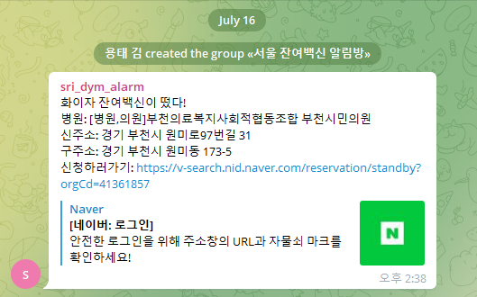
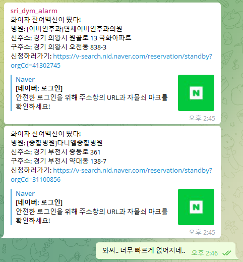
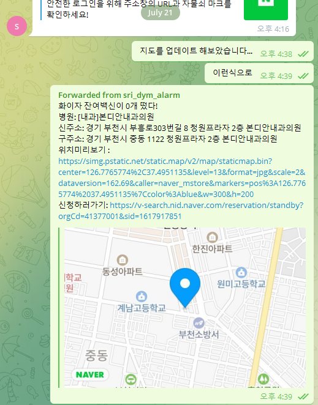
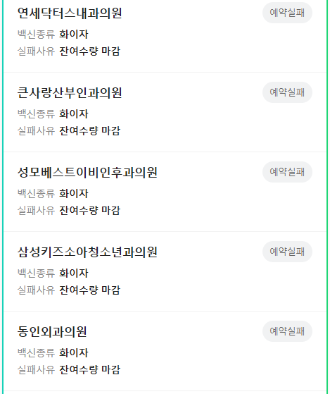

## 소개

코로나 확진자가 500명을 왔다갔다 하던 2021년 7월 15일, 단톡방을 통해 잔여백신 예약 자동화 매크로(크롬확장프로그램)가 있다는 소식을 들었습니다.  
얀센을 맞을 수 있었으나 화이자와 모더나가 탐이나 기다리고 있던 한 개발자는... 매크로라는 단어에 꽂히게 되었습니다.  
이 글은 직접 매크로를 만들고 싶었던 한 개발자의 타임라인입니다.

## 타임라인

### 2021년 7월 15일 목요일

네이버의 잔여백신 지도를 뜯어봄.  
`https://api.place.naver.com/graphql`에서 현재 지도상의 병원들 목록을 가져오는 것을 확인함.  
`javascript`로 `graphql`을 호출하여 백신이 있는 병원이 있으면 `telegram`으로 메세지를 보내기를 시도함.

### 2021년 7월 16일 금요일

이런 소식을 나만 받을 수 없지! 지인들을 초대하고 잔여백신 신청을 장려함.  

그러나 `telegram`으로 오는 잔여백신 알림을 눌러 신청하러 가면... 백신이 이미 없다...  


### 2021년 7월 19일 월요일

병원 리스트를 5초마다 검색해서 이미 사라졌나 싶어서 2초로 줄여보았으나... 여전하다... 구경이라도 해보고 싶었다...  

### 2021년 7월 21일 수요일

보일 듯이 보일 듯이 보이지 않는 잔여백신 때문에 애꿎은 `telegram` 메세지 내용만 업데이트 해본다...


### 2021년 7월 24일 토요일

개빡쳤습니다.  
내가 이러려고 잔여백신 알림을 받았나 하는 자괴감이 들어 알아서 신청까지 할 수 있나 뒤져보는데...  
어? 왠지 될 것 같은 기분이...?

### 2021년 7월 26일 월요일

개편한 스크립트로 테스트를 진행하니... 보이지 않던 잔여백신이 무려 15번 넘게 예약 시도했다는 기록이 남겨졌다!  

다양한 병원에서 잔여백신 접종이 되고 있다는 것을 확인할 수 있다.

### 2021년 7월 27일 화요일

오늘도 보람찬 하루를 보내기 위해 열심히 일을 하고 있었다.  
분명 그랬다. 한 통의 문자가 오기 전까지는 말이다.

```toc

```
